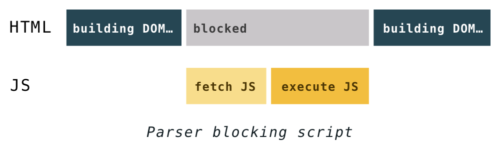
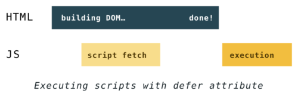

# Html is not what you think. 🤔

<p align="center">
  
</p>
 
#### There are total 145 HTML tags which are being used all over the world, but only around 40+ are semantic !!

### 🔍 What is 'semantic tags' 

semantic tags are those tags which have meaning in the tag itself, they don't need any extra explaination for their identity.

##### bro, nahi samjha ? 😬

dekh tu jab div tag likhta hai tuze pehle se pata hota hai kya ki usmain kya kya ayega ?, nahi, tu uske liye uske class main ya use ek special id deta hai kyon ki woh identify ho, and semantic tags wahi kaam karte hai, tuze uske liye alag se lihhne ki jarurat nahi hai.

```html
<div class="navbar">
    This is my navbar
</div>

is not SEO friendly

<nav>
    Yes, this is my SEO friendly navbar.
</nav>

This provides the browser a clear information about your tag :)
```

#### 💻 The modern HTML needs to be modern !!
### Why HTML5

The HTML5 comes with user interaction that is semantic, accessible, improving performance using attributes & tooling, organizing code for resuse and maintainability.

##### par bhai yeh changes kyon ⁉️

jab bhi tu code likhta hai (HTML main), SEO ke liye tu semantic tags likhta hai, even it seems unimportant beacuse usually they do not affect the visuals but in the browser the web page is being viewed by more than just humans - web crawlers/engines, search engines, screen readers and more, all depends ont the semantic HTML not your simple DIVs.

### Boilerplate of HTML5 🧱

```html
<!doctype html>
<html lang="en">
  <head>
    <meta charset="UTF-8" />
    <meta name="viewport" content="width=device-width, initial-scale=1.0" />
    <title>Html is not what you think.</title>
  </head>
  <body></body>
</html>
```

This is normal boilerplate of HTML5 in which each tags defines it's actual identity (this are semantic tags)

* <!doctype html> : Tells browser that this whole file's code is written in HTML
* < html lang="en"> : English language is used while writing this code
* meta tags : tells browser that each tag has it's own purpose
* title tag : tells what is the title of the web page that will be shown at the top of the website
* body tag : whatever the user is going to see is written in body tag

### Improving accesibility 🪄

```html
   <input type="text" placeholder="Search">  
```

In this code, the code looks normal but it limits to humans only, what about SEO (search engine optimization), to make it available for screen readers and other technologies, we use ARIA attribiutes.

```html
    <input type="text" placeholder="Search" aria-label="Search">  
```

ARIA comes under WIA-ARIA:
```
Web Accessibility Initiative - Accessible Rich Internet Applications (in short ARIA Attributes 😉)
```

This migh seems like minor changes but it become more important as we use the HTML for beyond basic documentation.

<p align="center">
  
</p>

### Improving performance with HTML attributes ⚡️

##### 1 : bhai woh maine defer aisa kuch toh suna tha performance ke liye, woh kya hai? 🧐

##### 2 : tune kabhi head tag main script tags use kiye hain ? 🧑‍🏫

##### 1 : ha bhai kiye hai, sabhi karte hai usse iska ka matlab

##### 2 : usi wajah se nalle tuze koi fokat internship bhi nahi deta 😒, jab bhi tu direct head tag main script tag use karta hai tab teri website ki performance down hoti hai aur lead hone main jyada samay leti hai, kyon ki browser hamesha dom building pe focus karta hai aur script tags ko hold par rakhta hai.

<p align="center">
  
</p>

##### 1 : toh bahi solution ? ⏳

##### 2 : solution hai ki sare script tags ko body tag main dal de, ab yeh mat puch kaha dalu 

```
In body tag, script tags always comes just above the closing body tag (</body>)
```

##### 1 : par bhai ab bhi tune defer ka bataya nahi ?

##### 2 : jab bhi tu defer tag use karta hai as a attribute in script file, woh website ki loading speed ko badha deta hai, simultaneously script tags ko bhi dom building ke sath load karta hai. 

<p align="center">
  
</p>

```
 <script defer src="https://code.jquery.com/jquery-3.3.1.slim.min.js" integrity="sha384-q8i/X+965DzO0rT7abK41JStQIAqVgRVzpbzo5smXKp4YfRvH+8abtTE1Pi6jizo" crossorigin="anonymous"></script>

benifits?:
- render fast hoti hai website
- can use script in head tag = organised scripts in HTML
- no matter where you put the script tag 

More options:
- async attribute for script tags 
- rel="preload" attribute for link tags
```

##### 1 : kya bhai bas itne hi attributes hai ?

##### 2 : nahi bro, iske tarah bohot sare attributes hai, ab tu bhi padh kuch to sab kya main hi sikhau?


### Improving performance with tooling 🛠️

There are many ways to improve performance using tools like:

##### Code minification

In this what we do actually that we use program that analizes and removes unnecessary redundant data from the code, removing the unnecessary spaces to complex and minimal things like renaming long varibles into short variables.

```
Example:
```


```
In the above image we can see the minified versions of the bootstrap cdn, this type of code minification helps the browser to load the required file even in the slow internet.
```

There are plenty of ways like File Concentation (only for HTTP/1.1), Critical Css (load the layout css in html inline css).


### Final Summary 

There are  a lot of things like semantic tags, lazy loading, improving performance, core web vitals, JSON-LD script tag and much more things that are important than learning how to build a website, you always have to work on this things because users leave slow websites no matter how much improved your UX is 😊.


<p align="right">
  
</p>

# It’s an exciting time to be a developer - Abhijeet Mhatre ❤️